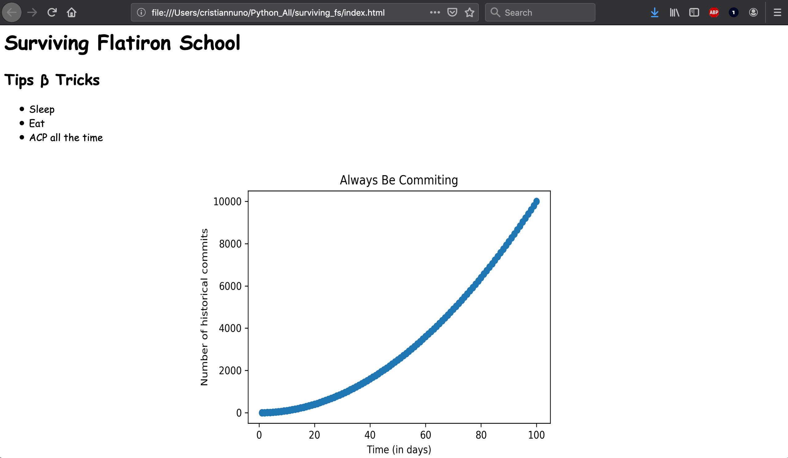
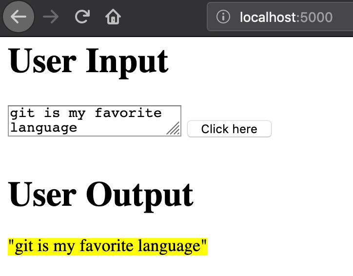

# Surviving Flatiron School

Learning how to make a static and dynamic website using HTML.

## Run Static Website Locally

After you've cloned a local copy of this repository, run the following commands in the terminal:

```bash
cd surviving_fs/
open index.html
```



## Run Dynamic Website Locally

After you've cloned a local copy of this repository, run the following commands in the terminal:

```bash
cd surviving_fs/
FLASK_APP=app.py flask run
```



## Requirements

This repo uses Python 3.6.0. All python packages can be found in the `requirements.txt` file.
